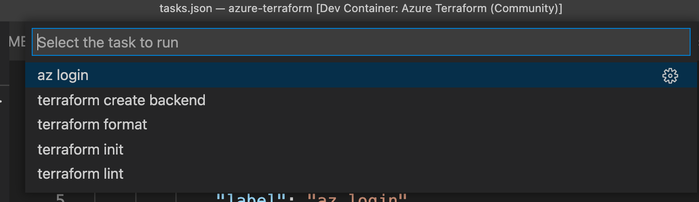

# Azure Terraform (Community)

## Summary

[Terraform](https://www.terraform.io/) is an open-source tool that provides the ability to build, change, and version infrastructure as code using declarative configuration files with HashiCorp Configuration Language (HCL).

This recipe allows you to get going quickly with Terraform in Azure. Includes Terraform, the Azure CLI, the Docker CLI (for testing locally), Node.js for Cloud Shell, and related extensions and dependencies.

| Metadata | Value |  
|----------|-------|
| *Contributors* | [Carlos Mendible](https://github.com/cmendible), [Charles Zipp](https://github.com/charleszipp), [Lila Molyva](https://github.com/norelina), [Tas Devani](https://github.com/tasdevani21)  |
| *Categories* | Community, Azure, Other |
| *Definition type* | Dockerfile |
| *Works in Codespaces* | Yes |
| *Container host OS support* | Linux, macOS, Windows |
| *Container OS* | Debian |
| *Languages, platforms* | Azure, Terraform |

## Using this definition

While technically optional, this definition includes the Azure Terraform extension which requires a few pre-requisites:

- [Azure Subscription](https://azure.microsoft.com): A current Azure subscription or a [free trial](https://azure.microsoft.com/en-us/free/) account needed.

You can also choose the specific version of Terraform installed by updating the following line in `.devcontainer/devcontainer.json`:

```Dockerfile
"arg": {
   "TERRAFORM_VERSION": "0.14.5"
   "TFLINT_VERSION": "0.24.1",
   "TERRAGRUNT_VERSION": "0.28.1"
   "INSTALL_AZURE_CLI": "true",
   "INSTALL_DOCKER": "true",
   "NODE_VERSION": "lts"
}
```

If you plan to use the Azure Cloud Shell for all of your Terraform operations, you can set `"INSTALL_DOCKER": "false"`. Conversely, if you do not plan to use Cloud Shell, you can set `"NODE_VERSION": "none"`. By default, both are installed so you can decide later.

Beyond `git`, this `Dockerfile` includes `zsh`, [Oh My Zsh!](https://ohmyz.sh/), a non-root `vscode` user with `sudo` access, and a set of common dependencies for development.

### Adding the definition to a project or codespace

1. If this is your first time using a development container, please see getting started information on [setting up](https://aka.ms/vscode-remote/containers/getting-started) Remote-Containers or [creating a codespace](https://aka.ms/ghcs-open-codespace) using GitHub Codespaces.

2. Start VS Code and open your project folder or connect to a codespace.

3. Press <kbd>F1</kbd> select and **Add Development Container Configuration Files...** command for **Remote-Containers** or **Codespaces**. 

   > **Note:** If needed, you can drag-and-drop the `.devcontainer` folder from this sub-folder in a locally cloned copy of this repository into the VS Code file explorer instead of using the command.

4. Select this definition. You may also need to select **Show All Definitions...** for it to appear.

5. Finally, press <kbd>F1</kbd> and run **Remote-Containers: Reopen Folder in Container** or **Codespaces: Rebuild Container** to start using the definition.

## Testing the Definition

This definition includes some test code that will help you verify it is working as expected on your system. Follow these steps:

1. Follow steps 1-4 from the above [section](#adding-the-definition-to-your-project).
2. Fill in the values for the environment variables in the [`.devcontainer/devcontainer.env` file](https://code.visualstudio.com/docs/remote/containers-advanced#_option-2-use-an-env-file)
   - This file allows customization of the environment variables and the values needed for the terraform tasks.

3. Open the Command Palette with `Ctrl/CMD+Shift+P` or press <kbd>F1</kbd> and run **Remote-Containers: Reopen Folder in Container** to start using the definition.

4. VS Code tasks have been configured to run commonly used Terraform commands. The `test-project` folder includes a Terraform template that provisions a new Azure Resource Group and the commands can be run via `Ctrl/CMD+Shift+P` > `Tasks: Run Tasks`.
   

A more detailed explanation of the tasks can be found in the next [section](#running-the-tasks).

## Running the Tasks

Once the environment settings are configured with the `.devcontainer/devcontainer.env`, you can begin executing terraform commands. VS Code tasks have been configured to run each of the commonly used terraform commands.

- `az login`: login to Azure and set your default subscription
- `terraform create backend`: create (if it does not exists) a remote azurerm backend (storage account)
- `terraform init`: installs plugins and connect to terraform remote backend
- `terraform format`: fix formatting issues
- `terraform lint`: fix linting issues

For additional terraform commands, you can use the [Azure Terraform extension](https://marketplace.visualstudio.com/items?itemName=ms-azuretools.vscode-azureterraform). 
- Navigate to the directory where the templates are located (`test-project/templates`)
- Open the Command Palette with `Ctrl/CMD+Shift+P` or press <kbd>F1</kbd> and run the following: 
   - `Azure Terraform: Validate`: check templates for syntax errors
   - `Azure Terraform: Plan`: report what would be done with apply without actually deploying any resources
   - `Azure Terraform: Apply`: deploy the terraform templates
   - `Azure Terraform: Destroy`: destroy resources deployed with the templates

For a complete list of all the available commands as part of the Azure Terraform extension, please visit [this page](https://marketplace.visualstudio.com/items?itemName=ms-azuretools.vscode-azureterraform)

## References

- [Terraform Overview](https://www.terraform.io/intro/index.html)
- [Terraform Tutorials](https://learn.hashicorp.com/terraform?utm_source=terraform_io)
- [Terraform with Azure](https://docs.microsoft.com/en-us/azure/terraform/terraform-overview)
- [Terraform Extension](https://marketplace.visualstudio.com/items?itemName=HashiCorp.terraform)
- [Azure Terraform Extension](https://marketplace.visualstudio.com/items?itemName=ms-azuretools.vscode-azureterraform)

## License

Copyright (c) Microsoft Corporation. All rights reserved.

Licensed under the MIT License. See [LICENSE](https://github.com/microsoft/vscode-dev-containers/blob/main/LICENSE).
