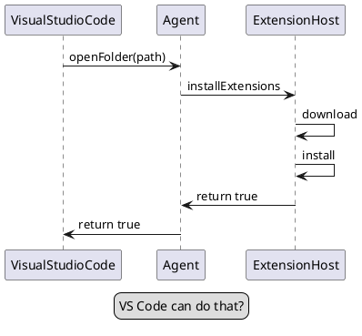

# Markdown Sample

Open the markdown preview to check it out!

## Code
```
@startuml
legend
    VS Code can do that?
end legend
VisualStudioCode -> Agent: openFolder(path)
Agent -> ExtensionHost: installExtensions
ExtensionHost -> ExtensionHost: download
ExtensionHost -> ExtensionHost: install
ExtensionHost -> Agent: return true
Agent -> VisualStudioCode: return true@enduml
```

## Diagram
