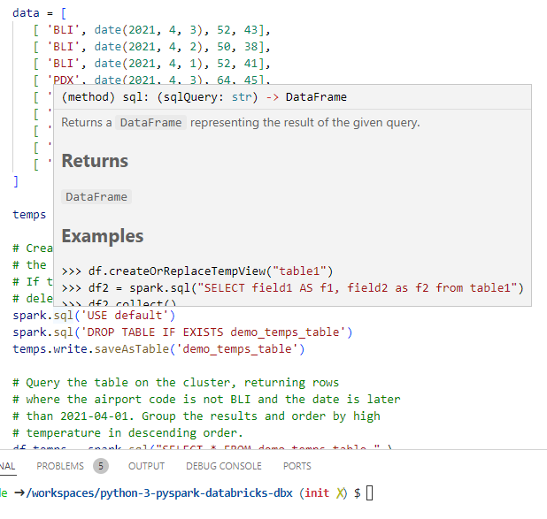
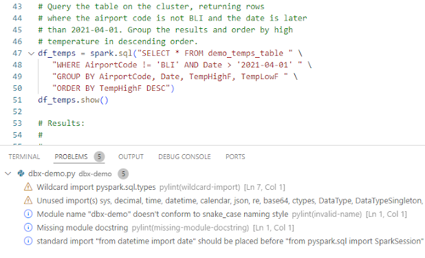
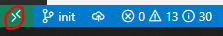
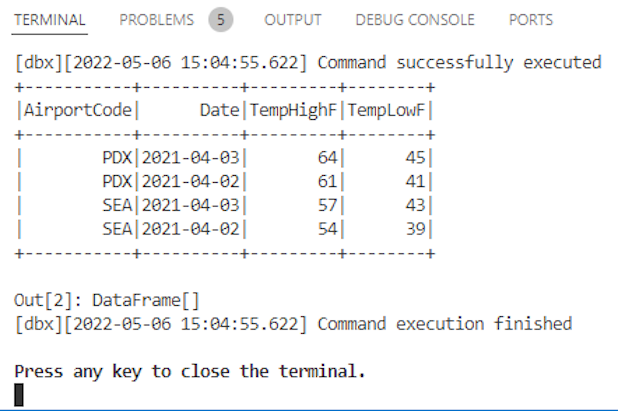

# Python 3 - Pyspark - Databricks - dbx

## Summary

Develop your own **Pyspark** applications under a fully configured **Python 3** development environment. Test them locally or send jobs to your **Databricks** workspace using **dbx**. Get all of these functionalities integrated directly in **VS Code** without any extra configuration work!





*This definition is an extension of the **Python 3** containerized one. See the details [here](https://github.com/microsoft/vscode-dev-containers/blob/main/containers/python-3/README.md). Check the official repo with all the containerized development environments for **Visual Studio Code** [here](https://github.com/microsoft/vscode-dev-containers).

*The integration with **dbx** and a couple of examples are demonstrated in [this](https://docs.microsoft.com/en-us/azure/databricks/dev-tools/dbx) official document from Microsoft.

## Using this definition

### **Set up the containerized environment**

#### **Step 1** - Clone the repo using **git**

```bash
git clone <repo>
```

#### **Step 2** - If you prefer, to simplify things get rid of the version control now

Windows console:

```bash
rmdir .git /s /q
```

Linux & Mac:

```bash
rm -rf .git/
```
### **Step 3** - Get **VS Code Remote - Containers extension**

You can get it [here](https://aka.ms/vscode-remote/download/containers).

### **Step 4** - Load the containerized environment

Click on the **Remote Window toolbox** and then `Open Folder in Container...`



You will need to have **Docker** installed on your machine. If you do not have it, the **VS Code Remote - Containers extension** will guide you to get it.

### **Step 5** - Browse to your copy of the repo
If everything went well, **VS Code** should be now connected to the container image which should be running a **VS Code Server** instance inside.

### **Creating a new local pyspark project**

### **Step 1** - Press `CTRL + SHIFT + P` and select `Tasks: Run Task` and then `New local pyspark project`

You will need to choose a name for your project. A new folder with the name of your project will be created.

Press a key to close the terminal.

### **Step 2** - Add your code to the recently created file `project_name/project_name.py`

By default, a simple **pyspark** template is deployed:

```python
# For testing and debugging of local objects, run
# "pip install pyspark=X.Y.Z", where "X.Y.Z"
# matches the version of PySpark
# on your target clusters.
from pyspark.sql import SparkSession

from pyspark.sql.types import *
from datetime import date

spark = SparkSession.builder.appName("dbx-demo").getOrCreate()

# Create a DataFrame consisting of high and low temperatures
# by airport code and date.
schema = StructType([
   StructField('AirportCode', StringType(), False),
   StructField('Date', DateType(), False),
   StructField('TempHighF', IntegerType(), False),
   StructField('TempLowF', IntegerType(), False)
])

data = [
   [ 'BLI', date(2021, 4, 3), 52, 43],
   [ 'BLI', date(2021, 4, 2), 50, 38],
   [ 'BLI', date(2021, 4, 1), 52, 41],
   [ 'PDX', date(2021, 4, 3), 64, 45],
   [ 'PDX', date(2021, 4, 2), 61, 41],
   [ 'PDX', date(2021, 4, 1), 66, 39],
   [ 'SEA', date(2021, 4, 3), 57, 43],
   [ 'SEA', date(2021, 4, 2), 54, 39],
   [ 'SEA', date(2021, 4, 1), 56, 41]
]

temps = spark.createDataFrame(data, schema)

...
```

### **Step 3** - Once you are ready, press `F5` to run your **pyspark** code locally

If everything works fine, you should see the result of the execution on the current terminal window.

### **Creating a new dbx project for Dabricks connectivity**

### **Step 1** - First of all, check that your python versions for **Databricks** and for the container are compatible

To check **Databricks**, use a simple magic command in a notebook cell:

```text
%sh
python --version
```

To check the container, launch this **python** command from your current terminal:

```bash
python --version
```

### **Step 2** - Press `CTRL + SHIFT + P` and select `Tasks: Run Task` and then `New dbx project`

You will need to choose a name for your project and the following parameters to set up your **Databricks** connection:

- Host of your **Databricks** workspace.
- PAT (Personal Access Token) of your **Databricks** workspace.
- ID of the cluster of your **Databricks workspace you want to use. 

A new folder with the name of your project will be created. The **Databricks** configuration files will be stored inside under `project_name/conf/databricks-config.sh` file, but for security reasons these data will not be tracked by the version control (a proper glob pattern was added to **.gitignore**). Please, note that if you need it, you can modify manually the values in this file to update them:

```bash
export DATABRICKS_HOST="<DATABRICKS_HOST>"
export DATABRICKS_TOKEN="<DATABRICKS_TOKEN>"
export DATABRICKS_CLUSTER_ID="<DATABRICKS_CLUSTER_ID>"
```

Press a key to close the terminal.

### **Step 3** - Add your code to the recently created file `project_name/project_name.py`

By default, a simple **pyspark** template is deployed:

```python
# For testing and debugging of local objects, run
# "pip install pyspark=X.Y.Z", where "X.Y.Z"
# matches the version of PySpark
# on your target clusters.
from pyspark.sql import SparkSession

from pyspark.sql.types import *
from datetime import date

spark = SparkSession.builder.appName("dbx-demo").getOrCreate()

# Create a DataFrame consisting of high and low temperatures
# by airport code and date.
schema = StructType([
   StructField('AirportCode', StringType(), False),
   StructField('Date', DateType(), False),
   StructField('TempHighF', IntegerType(), False),
   StructField('TempLowF', IntegerType(), False)
])

data = [
   [ 'BLI', date(2021, 4, 3), 52, 43],
   [ 'BLI', date(2021, 4, 2), 50, 38],
   [ 'BLI', date(2021, 4, 1), 52, 41],
   [ 'PDX', date(2021, 4, 3), 64, 45],
   [ 'PDX', date(2021, 4, 2), 61, 41],
   [ 'PDX', date(2021, 4, 1), 66, 39],
   [ 'SEA', date(2021, 4, 3), 57, 43],
   [ 'SEA', date(2021, 4, 2), 54, 39],
   [ 'SEA', date(2021, 4, 1), 56, 41]
]

temps = spark.createDataFrame(data, schema)

...
```

### **Step 4** - Once you are ready, press `CTRL + SHIFT + P` and select `Tasks: Run Task` and then `Run dbx project` to send a job to your Databricks workspace

You will be asked again about the name of your project. If everything works fine, you should see the result of the execution on a new terminal window:



Press a key to close the terminal.

### **Step 5** - Finally, to close the remote session with the container, click again on the **Remote Windows toolbox** and select `Close Remote Connection`

## License

Copyright (c) Microsoft Corporation. All rights reserved.

Licensed under the MIT License. See [LICENSE](https://github.com/microsoft/vscode-dev-containers/blob/main/LICENSE)
